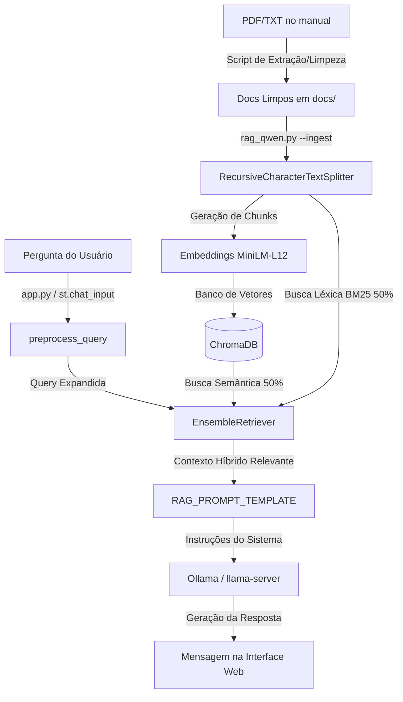

# Desenvolvimento e Arquitetura do Sistema

Este documento descreve as decisões de arquitetura, fluxo de dados, lógica customizada e estrutura técnica implementada no pipeline RAG do Assistente Virtual do SEI.

---

## 🏗️ Fluxo de Arquitetura RAG Híbrida

O sistema utiliza uma abordagem **híbrida** para garantir que termos técnicos específicos e abreviações (como "sei" ou "atestados") sejam encontrados com precisão, contornando limitações normais de buscas puramente semânticas.



---

## 🛠️ Tecnologias e Decisões de Design

### 1. Busca Híbrida (`EnsembleRetriever`)
Combinamos dois algoritmos com pesos iguais (0.5 cada) para a recuperação do contexto:
- **ChromaDB (Semântico)**: Captura o contexto geral da pergunta usando distância vetorial baseada no modelo `paraphrase-multilingual-MiniLM-L12-v2`. Excelente para perguntas descritivas (ex: "como assinar um documento").
- **BM25 (Léxico)**: Encontra correspondências exatas por termos. Essencial para palavras-chave curtas ou códigos específicos que buscas semânticas podem ignorar (ex: siglas como "SEI", "PDF" ou palavras específicas como "atestados").

### 2. Embeddings Multilíngues
Migramos o modelo de embeddings para o `sentence-transformers/paraphrase-multilingual-MiniLM-L12-v2` (rodando localmente via HuggingFace). Ele oferece excelente performance em português para mapeamento de conceitos, superando modelos genéricos em inglês.

### 3. Orquestração e Interface
- **LangChain**: Facilita a manutenção do pipeline com classes nativas de fácil substituição (`Chroma`, `BM25Retriever`, `RetrievalQA`).
- **Streamlit**: Permite uma interface rica, responsiva e com baixa sobrecarga de código. Customizada com injeção de CSS para um visual Dark Mode premium de acordo com a paleta de cores fornecida pelo usuário.

---

## 🧠 Lógicas Customizadas de Redundância e Robustez

### 1. Pré-processamento e Expansão de Queries (`preprocess_query`)
Implementamos uma função de tratamento de entrada em `rag_qwen.py` para mapear variações de termos comuns:
- **Case Sensitivity**: A busca é insensível a maiúsculas/minúsculas.
- **Expansão de Perguntas Curtas**:
  - Se o usuário digitar termos como `"sei"`, `"o que e sei"`, o sistema expande automaticamente para `"O que é o SEI (Sistema Eletrônico de Informações)?"`.
  - Se o usuário buscar por `"atestado"` ou `"atestados"`, expande para `"Como incluir documento externo ou atestado no processo?"`.

### 2. Prompt Inteligente de Fallback (`RAG_PROMPT_TEMPLATE`)
Caso a resposta exata para a pergunta do usuário não esteja no manual, o LLM segue regras específicas do Prompt do Sistema:
- Não inventa nem alucina dados.
- Explica de forma polida que a informação não foi encontrada diretamente.
- Varre os fragmentos de contexto recuperados e sugere de **2 a 3 assuntos correlacionados** (ex: se o usuário perguntou sobre atestados e o manual descreve inserção de "documento externo", ele orienta o usuário a refinar a busca usando este termo técnico).

---

## 📂 Estrutura de Arquivos

```text
e:\RAG_LLM\
│
├── .env.qwen               # Configurações do ambiente (embeddings, backend, diretórios)
├── app.py                  # Interface Streamlit do Chatbot (estilos CSS, layout, cache)
├── rag_qwen.py             # Script central RAG (ingestão, setup_rag_pipeline, CLI)
├── pdf_to_txt.py           # Utilitário para limpar PDFs e extrair textos brutos
├── requirements.txt        # Dependências do Python
│
├── docs/                   # Pasta contendo os arquivos do manual do SEI (.txt/.pdf)
├── chroma_db_qwen/         # Pasta onde os dados vetoriais do ChromaDB são persistidos
└── venv/                   # Ambiente virtual Python
```
